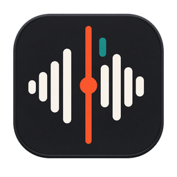
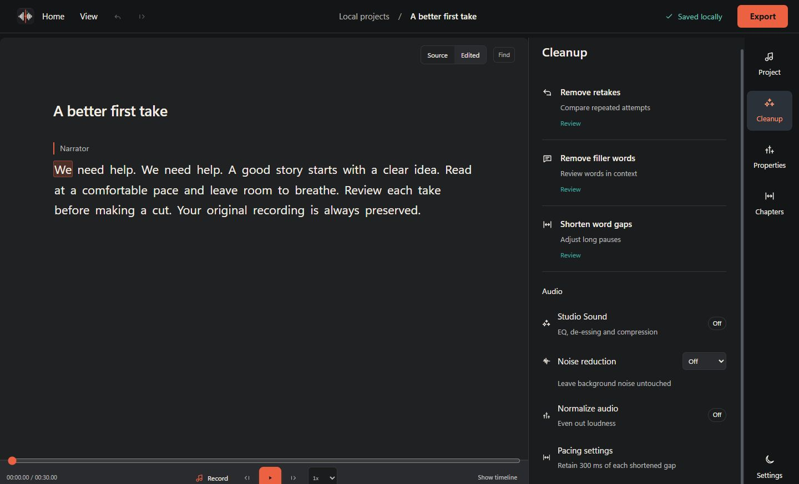
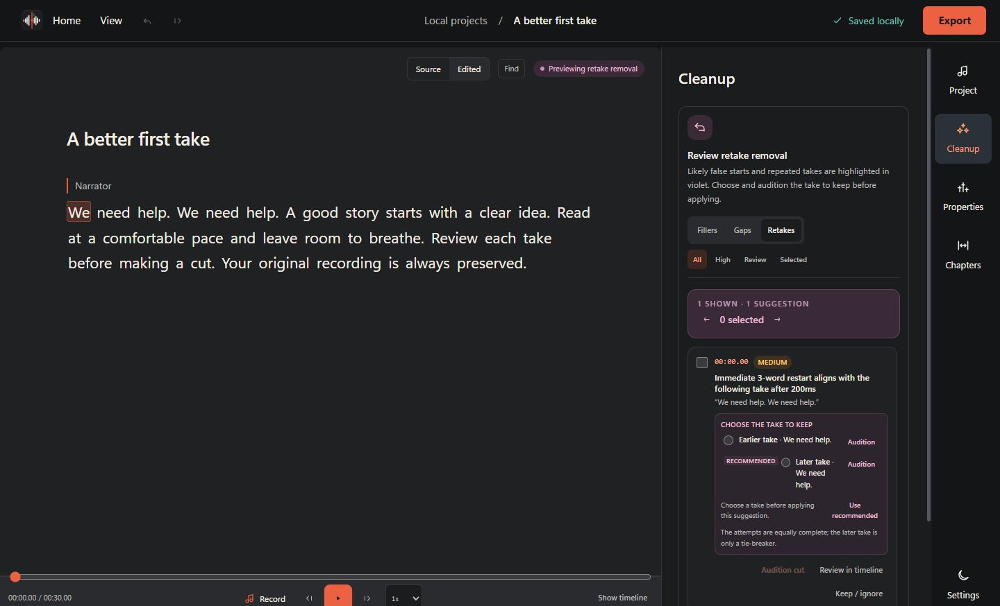
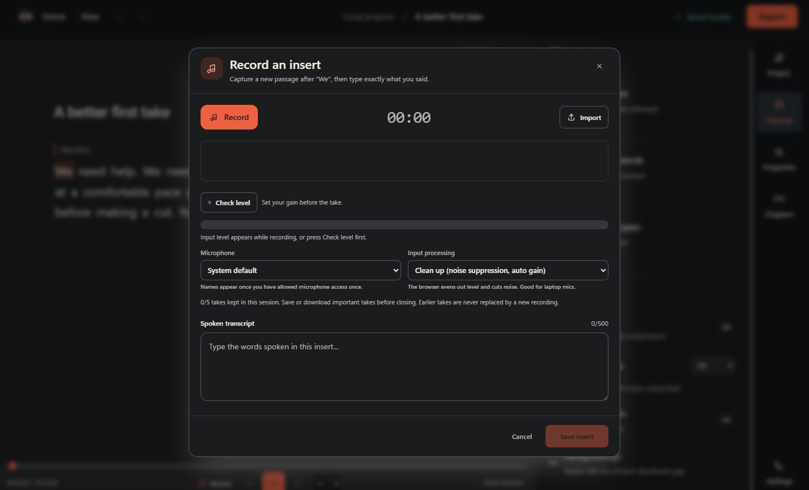

<p align="center">
  
</p>

<h1 align="center">ScriptSurgeon</h1>

<p align="center">
  <strong>Your audio. Under the knife.</strong><br>
  Edit audio by editing text. Local-first, open source, every feature free.
</p>

<p align="center">
  <a href="https://artmoreno.github.io/ScriptSurgeon/"><strong>Product page</strong></a>
  &nbsp;·&nbsp;
  <a href="#download-the-desktop-app"><strong>Download latest</strong></a>
</p>

<p align="center">
  <a href="https://github.com/ArtMoreno/ScriptSurgeon/actions/workflows/ci.yml"></a>
  
  
  
  
  
</p>

<p align="center">
  <a href="https://artmoreno.github.io/ScriptSurgeon/">
    
  </a>
</p>

## Edit audio by editing text

ScriptSurgeon turns spoken audio into an editable transcript. Remove a word and its matching audio leaves the timeline. Restore it and the sound comes back. Tighten long pauses, review retakes, add a missing line, and export a clean WAV without sending the project to a cloud service.

It is built for people who want the speed of a document editor without giving up control of the actual recording.

## What's new in the September workspace update

- **A document-first workspace:** centered transcript, contextual tools, collapsible timeline, and a searchable project home.
- **Retakes stay under your control:** compare attempts, audition the proposed cut, choose what to keep, and undo changes. Detection handles more long restarts and corrections; uncertain cases remain review-only.
- **A more useful recorder:** microphone selection, live input history, clipping feedback, pause/resume, take comparison and direct take downloads. Delivered audio is retained after some interruptions; full crash recovery is not yet available.
- **More dependable delivery:** clear range durations and download feedback. WAV ranges preserve the finished render's sample rate and audio samples.
- **Refreshed identity:** the new icon is used throughout the workspace and Windows build.

These changes are on the current source branch. [Published installers](https://github.com/ArtMoreno/ScriptSurgeon/releases/latest) may be an earlier version. Screenshots use a demonstration project.

## One local workflow

| 1. Record | 2. Transcribe | 3. Cut | 4. Restore | 5. Export |
| --- | --- | --- | --- | --- |
| Import media or begin with your microphone. | The bundled speech model runs on your machine. | Edit transcript words and the audio follows. | Bring back words, pauses, retakes, or inserted audio. | Preview the assembled edit and save WAV. |

## Cut the fluff. Keep the story.

Select transcript words or a whole passage, then ripple-cut the matching audio. Correct transcript text without changing sound. Click words to seek, or use the waveform when you need precise timing.

The automatic cleanup tools stay separate so each decision remains understandable:

- **Remove fillers** previews filler words only.
- **Shorten gaps** changes long pauses only.
- **Remove retakes** reviews repeated phrases only.

Nothing changes until you confirm the preview.

<p align="center">
  
</p>

## Nothing is ever really gone

Removed words remain visible and restorable. Retake groups can be brought back. Inserted passages can be removed, restored, edited, or re-recorded. Multi-step undo covers the editing session.

Right-click transcript words, pause markers, retake groups, or inserted passages for focused actions. `Shift+F10` opens the same menus from the keyboard.

## Add new audio right in place

Start a new project from your microphone, or record a missing passage inside an existing edit. Place the insert at the selected word or current playhead, update its transcript, and re-record it later without losing the edit point.

The recorder shows input level while you capture, so a muted microphone or a gain set too hot is obvious before you commit the take rather than after. Pause and resume without ending the take, pick an input when more than one is connected, and record as many takes as you like: earlier ones stay available to compare and switch between until you save.

<p align="center">
  
</p>

## Finish somewhere else

Not every edit ends in ScriptSurgeon. Export the cut as an **EDL** or **Final Cut XML** - the standard interchange formats for moving an edit between editors. Both describe your cut as a list of in and out points against your original recording rather than a render, so the handoff is instant and the source stays untouched.

Final Cut XML carries the most: every kept run as its own clip, inserted takes as real clips, and your markers and chapters attached to the clips that contain them.

Both formats are frame-based, so edit points land on the nearest frame of the timeline you import into. The exported WAV or MP3 remains the sample-accurate version of your edit.

## No cloud. No compromises.

| On your device | No accounts | No API keys | You are in control |
| --- | --- | --- | --- |
| Projects, transcription, previews, and exports run locally. | No sign-up or login is required. | Normal use needs no paid service or secret key. | Your project files remain on your computer. |

The desktop shell protects its local API with a new random session token, accepts only trusted loopback hosts, and keeps diagnostic logs on the machine. See [SECURITY.md](SECURITY.md) for the security model and responsible disclosure.

> [!IMPORTANT]
> Download desktop builds only from the [latest GitHub Release](https://github.com/ArtMoreno/ScriptSurgeon/releases/latest). Windows and macOS packages are attached there only after their native build and smoke checks succeed.

## Everything, free

There is no paid tier, no account, and nothing held back. Every capability below
ships in every build, on both platforms.

| | |
| --- | --- |
| Local transcription | Runs on your machine with the bundled model |
| Transcript editing and ripple cuts | Remove a word, the audio follows |
| Filler, gap, and retake cleanup | Reviewed before anything is applied |
| Markers and chapters | Local, with chapter audio and chapter list export |
| Studio Sound and loudness normalize | Tone shaping and an EBU R128 target |
| Background noise cleanup | Three strengths, applied before tone shaping |
| WAV and MP3 export | Full file or a selected range |
| Transcript, SRT, VTT export | Including chapter headings and cues |
| Timeline handoff | EDL and Final Cut XML, against your original file |

## Download the desktop app

### Windows installer

Download the current Windows installer from the [latest GitHub Release](https://github.com/ArtMoreno/ScriptSurgeon/releases/latest). The release page is the source of truth for the installer, its SHA-256 checksum, and supported architecture.

### macOS DMG

The release page includes native Apple Silicon and Intel DMGs when their macOS build and smoke checks pass. The Apple Silicon package requires macOS 14 or later; the Intel package targets macOS 13 or later. The initial DMGs are ad-hoc signed but not notarized with Apple, so macOS may require an explicit approval before opening them. Verify the release checksum and open them only if you trust the release source.

## Build from source on Windows

The packaged desktop app uses Edge WebView2. Once built, it runs without a separate Python or Node.js installation.

```powershell
git clone https://github.com/ArtMoreno/ScriptSurgeon.git
cd ScriptSurgeon
./scripts/build.ps1
./scripts/install.ps1
```

The first build reuses an existing `Systran/faster-whisper-base` snapshot when available. Otherwise, it downloads the public model before packaging. No Hugging Face token or API key is required. Use `-ModelSource <directory>` to choose a specific local snapshot.

Each packaged build includes a SHA-256 payload manifest. Upgrades validate and stage the application, roll back on failure, and leave project data outside the deployable payload.

For an offline rebuild using an existing packaging environment and frontend output:

```powershell
./scripts/build.ps1 -SkipDependencies -SkipFrontend
```

## Development

Development requires Python 3.11 or 3.12, Node.js 18 or newer, and FFmpeg.

```powershell
./start.bat
```

For macOS or Linux development:

```bash
./start.sh
```

Then open `http://127.0.0.1:8000`.

The development model defaults to `base`. Set `MODEL_SIZE` to `tiny`, `small`, `medium`, or `large-v3` before launch to use another public model.

## Repository map

| Path | Purpose |
| --- | --- |
| `frontend/` | React, TypeScript, Zustand, and WaveSurfer transcript editor |
| `backend/` | FastAPI project storage, transcription, rendering, and export |
| `desktop.py` | Native Windows WebView2 shell and local process lifecycle |
| `scripts/` | Packaging, icon generation, payload verification, and installation |
| `docs/` | Dependency-free GitHub Pages product site |

## Verification

```powershell
./.venv/Scripts/python.exe -m pip install -r backend/requirements-dev.txt
./.venv/Scripts/python.exe -m pytest backend/tests -q
npm test --prefix frontend
npm run typecheck --prefix frontend
npm run build --prefix frontend
```

The static product page can be served directly from `docs/` with any local web server.

## Contributing

Contributions are welcome. Read [CONTRIBUTING.md](CONTRIBUTING.md), then open an issue for a bug or product idea. Keep fixtures, screenshots, logs, and diagnostics free of private recordings, real project names, credentials, tokens, and identifying local paths.

## License

ScriptSurgeon is available under the [MIT License](LICENSE). Third-party licenses are documented in [THIRD_PARTY_NOTICES.md](THIRD_PARTY_NOTICES.md).
